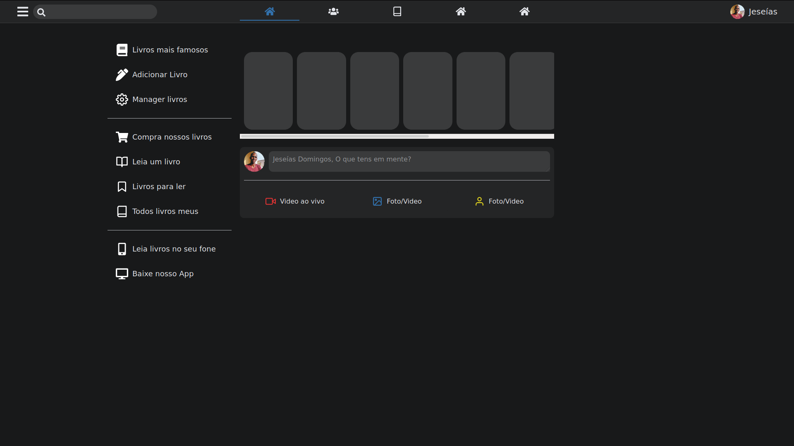

# Bookery - ProBooks 📚

At the present __moment__ I'm  __Mastering__ 😎 [NextJS](https://nextjs.org/), [Redux](https://redux.js.org/), [Redux-Saga](https://redux-saga.js.org/) and [Jest](https://jestjs.io/) 🔥. So I decided to build this fictional online dev library. Where by __devs__ who enjoy reading have a __perfect__ place to find __books__ 📘 to read.

This is aplication design inspiration comes from [Facebook](https://www.facebook.com/) __dark-mode__ web desktop client.

🚧 By the way still under development 🚧

 

> # How does the App work ❓
> __So easy to use__  
> 1. Login 🔐 using your __github_username__. So the app get your some of you info, like *name* and *avatar*.
> This features exists so I can make async call using __Redux-Saga__

At the moment thats all. 😔  
More features coming soon 🤘😎🔥

__Visit the app [here](https://bookery-iota.vercel.app/) to test it__

# To Be learned

- [ x ] Redux __Actions__ - __Types__ - __Reducers__
- [ x ] NextJS __NextReduxWrapper__ - __Routing__
- [ x ] __Root-Reducer__ - __Root-Sagas__
- [ x ] Testing Redux using __Jest__
- [  ] Testing __React Components__
- [  ] Top class proper __Authentication__

 # Please help

 If you master any of this __web technologies__ please go ahead and __suggest__ me specific topics to __master__
send me an email <domingosjeseias@gmail.com>
